### Resources
https://www.hellointerview.com/learn/system-design/core-concepts/networking-essentials

### The Big Picture

                         YOUR APPLICATION
                               │
            ┌──────────────────┼──────────────────┐
            │                  │                  │
        REST API          GraphQL API          gRPC
            │                  │                  │
     Architectural        Query language      RPC framework
        style             + runtime              │
            │                  │              Protobuf
            │                  │          serialization/schema
            └──────── HTTP ────┘                  │
                     │                         HTTP/2
                     │                            │
                     └──────────┬─────────────────┘
                                │
                    ┌───────────┴───────────┐
                    │                       │
                   TCP                     UDP
              reliable stream          datagrams
                    │                       │
                    └───────────┬───────────┘
                                │
                                IP
                                │
                               NETWORK

### OSI Model
┌─────────────────────────────────────────────┐
│ Layer 7 — APPLICATION                       │
│ HTTP, DNS, SMTP                             │
│ REST / GraphQL / gRPC concepts live here   │
├─────────────────────────────────────────────┤
│ Layer 6 — PRESENTATION                      │
│ Encoding, encryption, compression           │
├─────────────────────────────────────────────┤
│ Layer 5 — SESSION                           │
│ Session management                          │
├─────────────────────────────────────────────┤
│ Layer 4 — TRANSPORT                         │
│ TCP / UDP                                   │
├─────────────────────────────────────────────┤
│ Layer 3 — NETWORK                           │
│ IP                                          │
├─────────────────────────────────────────────┤
│ Layer 2 — DATA LINK                         │
│ Ethernet / Wi-Fi frames / MAC               │
├─────────────────────────────────────────────┤
│ Layer 1 — PHYSICAL                          │
│ Cable / fiber / radio / electrical signals  │
└─────────────────────────────────────────────┘

#### The three layers you should remember most strongly for system design:
L7 → Application → HTTP
L4 → Transport   → TCP / UDP
L3 → Network     → IP


#### IP vs TCP vs HTTP
HTTP
"What are the applications saying?"
             │
             ▼
TCP
"How do I deliver it reliably?"
             │
             ▼
IP
"Where does it need to go?"

#### TCP vs UDP
                    Layer 4
                       │
             ┌─────────┴─────────┐
             │                   │
            TCP                 UDP
             │                   │
        Connection          Connectionless
        Reliable            Best effort
        Ordered             No ordering guarantee
        Retransmit          No built-in retransmit

#### TCP
Think:

> **"Make sure the data arrives correctly and in order."**

**Typical uses:**
Web traffic (HTTP/1.1, HTTP/2)
Database connections
Email
File transfer
SSH

#### UDP
Think:

> **"Send the datagram without TCP's reliability machinery."**

**Typical uses:**
DNS
DHCP
WebRTC media
Online gaming
Real-time communication
QUIC / HTTP/3

**Important:**
UDP ≠ applications can never be reliable
HTTP/3
   ↓
 QUIC ← implements reliability etc.
   ↓
 UDP
   ↓
   IP

#### HTTP
HTTP is an **application-layer protocol**.

HTTP
│
├── Methods
│     ├── GET
│     ├── POST
│     ├── PUT
│     └── DELETE
│
├── Headers
│
├── Request body
│
├── Response body
│
└── Status codes
      ├── 200
      ├── 404
      └── 500

HTTP/1.1 → TCP → text-based requests/responses
HTTP/2   → TCP → multiplexed streams + binary framing
HTTP/3   → QUIC → UDP + multiplexed streams


**HTTP evolved mainly to improve:**
- Connection reuse
- Concurrency
- Latency
- Network efficiency
- Handling packet loss

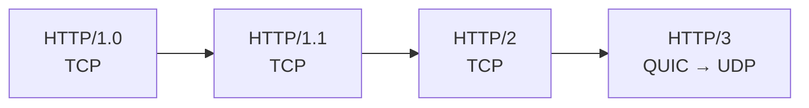

| Version  | Main Idea               |
| -------- | ----------------------- |
| HTTP/1.0 | New connection          |
| HTTP/1.1 | Reuse connection        |
| HTTP/2   | Multiplex over TCP      |
| HTTP/3   | Multiplex over QUIC/UDP |
##### 1. HTTP/1.0

HTTP/1.0 commonly followed this model:

> **Request → Response → Connection closes**

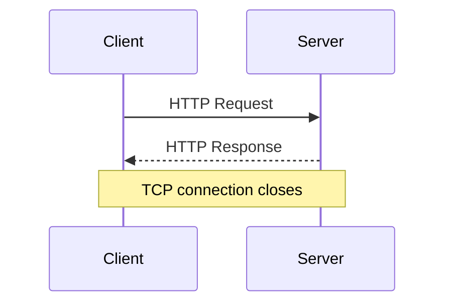

If a webpage needs multiple resources:

- HTML → TCP connection → response → close
- CSS → new TCP connection → response → close
- JavaScript → new TCP connection → response → close
- Image → new TCP connection → response → close
##### Main Problem
Creating a new TCP connection repeatedly adds overhead.
So the main idea is:

> **HTTP/1.0 = typically one request/response per TCP connection**

##### 2. HTTP/1.1

HTTP/1.1 introduced **persistent connections**.

Instead of closing the TCP connection after every response, the connection can be reused.

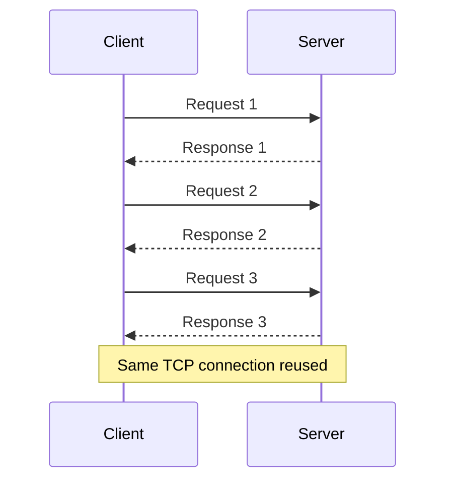

This is often called:

> **Persistent connection / Keep-Alive**

> **HTTP/1.1 = reuse the TCP connection**

**Main HTTP/1.1 Limitation**

HTTP/1.1 does **not provide true multiplexing** on a single connection.
HTTP/1.1 defined **pipelining**, where multiple requests could be sent before receiving the previous responses.
However, responses still had to be returned in order.

Example:
- Request A → slow
- Request B → ready
- Request C → ready

B and C may still be stuck behind A.

This is called:
> **HTTP-level Head-of-Line (HOL) blocking**

Because of this, browsers commonly opened multiple TCP connections to the same server.

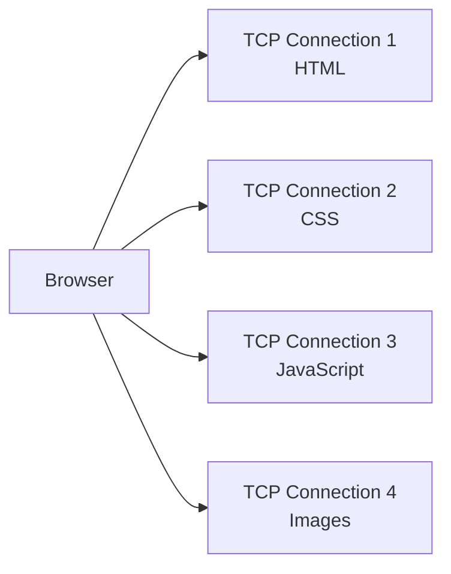

**Key Point**
> **HTTP/1.1 = persistent connections, but no true multiplexing**


3. HTTP/2

The biggest improvement in HTTP/2 is:

> **Multiplexing**

Multiple HTTP requests and responses can share **one TCP connection simultaneously**.

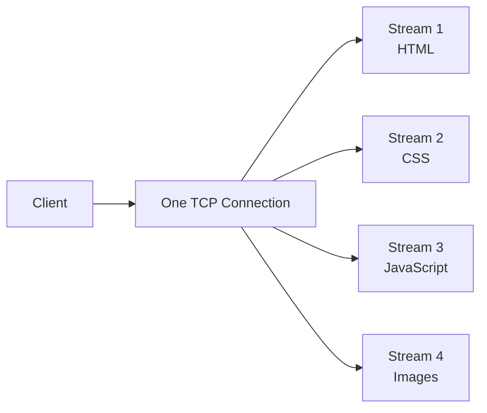

Instead of:

- TCP connection 1 → HTML
- TCP connection 2 → CSS
- TCP connection 3 → JavaScript

HTTP/2 can use:

- One TCP connection
  - Stream 1 → HTML
  - Stream 2 → CSS
  - Stream 3 → JavaScript
  - Stream 4 → Images

**What Is Multiplexing?**

HTTP/2 breaks communication into **frames**.
Frames from different streams can be interleaved.
For example:
```text
HTML-1
CSS-1
JS-1
HTML-2
CSS-2
JS-2
```

Each frame contains information identifying which HTTP/2 stream it belongs to.
Therefore multiple requests can make progress at the same time.

**Header Compression**

HTTP requests repeatedly send headers such as:
- Host
- User-Agent
- Accept
- Cookie
- Authorization

HTTP/2 uses:

> **HPACK**

to compress HTTP headers and reduce repeated data.

**HTTP/2 Server Push**

HTTP/2 also introduced **Server Push**.
The idea was:
1. Client requests `index.html`
2. Server sends `index.html`
3. Server proactively sends `style.css`

However, HTTP/2 Server Push had limited practical usefulness, and major browsers later removed/deprecated support.
For interviews:

> Server Push was introduced with HTTP/2, but it is not a major modern HTTP/2 advantage.

**HTTP/2 Problem: TCP Head-of-Line Blocking**

HTTP/2 solved HTTP-level multiplexing.
However, HTTP/2 still runs over **TCP**.

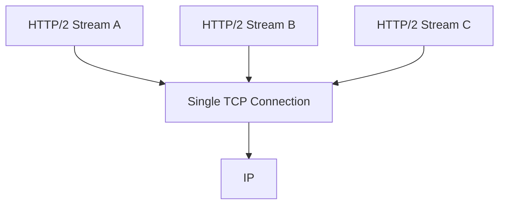

TCP guarantees:

> **Reliable and ordered byte delivery**

Suppose TCP receives:

- Packet 1 ✅
- Packet 2 ✅
- Packet 3 ❌ Lost
- Packet 4 ✅
- Packet 5 ✅

TCP must recover the missing data before it can deliver later bytes in order.
Because all HTTP/2 streams share the same TCP connection, packet loss can delay multiple streams.
This is called:

> **TCP-level Head-of-Line blocking**

This became one of the major motivations for HTTP/3.

##### HTTP/3

HTTP/3 makes a major transport-layer change.
HTTP/1.0, HTTP/1.1 and HTTP/2 use TCP.
HTTP/3 uses:

> **QUIC over UDP**

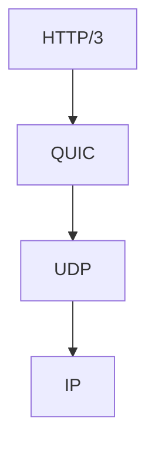

Compare:

| HTTP Version | Transport |
|---|---|
| HTTP/1.0 | TCP |
| HTTP/1.1 | TCP |
| HTTP/2 | TCP |
| HTTP/3 | QUIC over UDP |

**What Is QUIC?**

QUIC is a modern transport protocol that runs over UDP.
UDP itself does not provide TCP-style reliability.
QUIC builds the required functionality on top of UDP.
QUIC provides features such as:
- Reliable delivery
- Congestion control
- Multiplexed streams
- Encryption
- Connection management

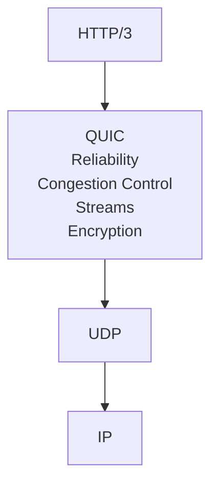

Therefore:

> **HTTP/3 is not unreliable just because UDP is underneath it.**

QUIC implements the reliability that HTTP/3 needs.

**Why HTTP/3 Helps With Head-of-Line Blocking**

HTTP/2 has multiple streams:

```text
Stream A
Stream B
Stream C
```

but they all depend on one TCP byte stream.
With HTTP/3, QUIC manages independent streams.

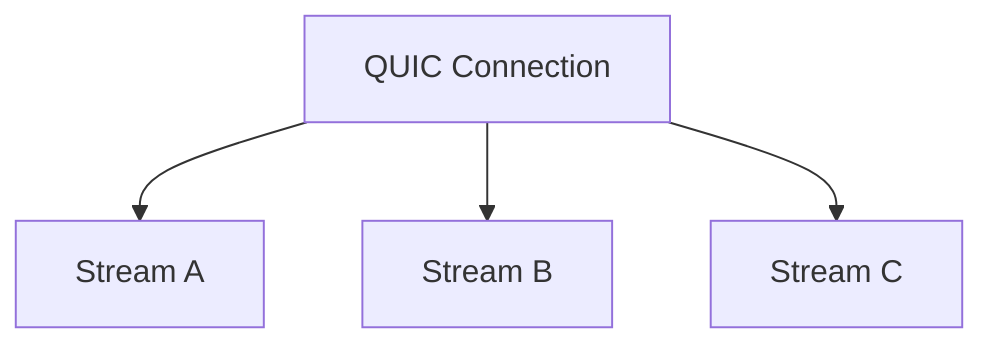

Suppose data belonging to Stream B is lost:

- Stream A → can continue
- Stream B → waits for its missing data
- Stream C → can continue

So:

> **HTTP/3 avoids TCP's cross-stream Head-of-Line blocking.**

**Important:**
The affected stream can still wait for its own missing data.
HTTP/3 does not magically remove all waiting.

**HTTP/3 and TLS**

Traditional HTTPS over TCP conceptually looks like:

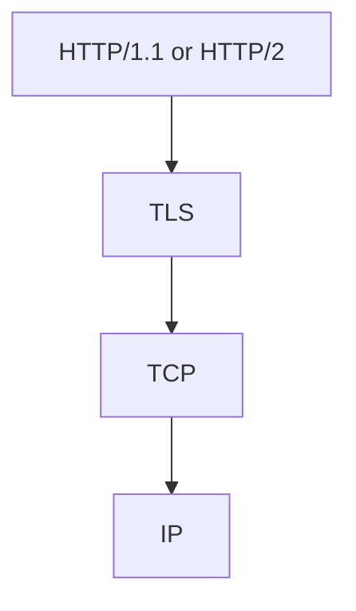

QUIC integrates **TLS 1.3** into the protocol.

HTTP/3 therefore looks like:

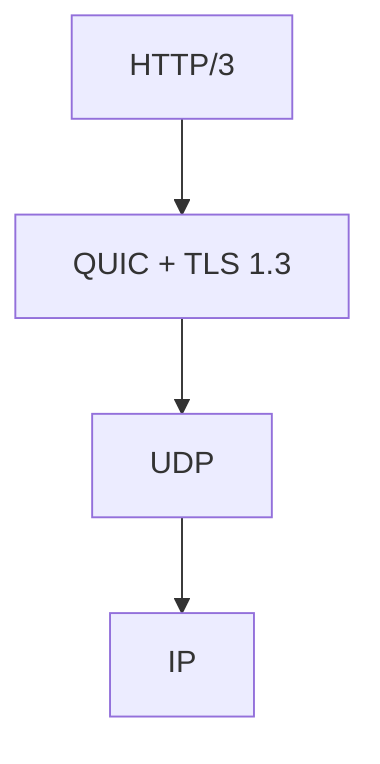

This helps reduce connection-establishment latency.

##### HTTP/1.0 vs HTTP/1.1 vs HTTP/2 vs HTTP/3

| Feature              | HTTP/1.0   | HTTP/1.1 | HTTP/2         | HTTP/3                       |
| -------------------- | ---------- | -------- | -------------- | ---------------------------- |
| Transport            | TCP        | TCP      | TCP            | QUIC over UDP                |
| Connection reuse     | Usually No | Yes      | Yes            | Yes                          |
| Multiplexing         | No         | No       | Yes            | Yes                          |
| Binary framing       | No         | No       | Yes            | Yes                          |
| Header compression   | No         | No       | HPACK          | QPACK                        |
| HTTP-level HOL       | Yes        | Yes      | Largely solved | Largely solved               |
| TCP cross-stream HOL | —          | —        | Yes            | No TCP                       |
| TLS                  | Separate   | Separate | Usually TLS    | TLS 1.3 integrated with QUIC |
| Connection migration | No         | No       | No             | Yes                          |

### REST
REST is **NOT a protocol**.
It is an **architectural style for designing APIs**.

HTTP = communication protocol
REST = API design principles

REST thinks primarily in terms of **resources**:

### GraphQL

GraphQL is an **API query language + runtime**.

Its big idea:
> **The client specifies exactly which fields it wants.**

**REST:**
GET /users/101
Server decides response shape.

**GraphQL:**
query {
  user(id: 101) {
    name
    email
  }
}

Response:
{
  "data": {
    "user": {
      "name": "Shivam",
      "email": "..."
    }
  }
}

GraphQL commonly exposes something like:
POST /graphql

### gRPC
gRPC is an **RPC framework**.
RPC = **Remote Procedure Call**.

**Instead of thinking**: GET /users/101
**you think:** GetUser(101)

**gRPC commonly uses:**
gRPC
  │
  ├── Protobuf
  │
  └── HTTP/2
         │
        TCP
         │
         IP
**Protobuf:**
**Protocol Buffers** is a schema + binary serialization mechanism.
**Example .proto file**
message User {
    int32 id = 1;
    string name = 2;
    string email = 3;
}

### REST vs GraphQL vs gRPC
REST
   │
   └── Think RESOURCES

       GET /users/101
GraphQL
   │
   └── Think DATA

       user(id:101) {
           name
           email
       }
gRPC
   │
   └── Think FUNCTIONS / METHODS

       GetUser(101)

### Server-Sent Events (SSE)

SSE allows the server to maintain an HTTP connection and **continuously push events to the client**.

**Normal HTTP:**
Client ─── request ───► Server
Client ◄── response ─── Server

**SSE:**
Client ─── connect ───► Server

Client ◄── event 1 ──── Server
       ◄── event 2 ────
       ◄── event 3 ────
       ◄── event 4 ────

       connection stays open

SSE is primarily:
SERVER ─────────► CLIENT

**Typical use cases:**
Notifications
Job progress
Live dashboards
News feeds
Streaming generated output
Status updates

### Polling vs SSE vs WebSocket

**Polling:**
Client ──► Any update?
Client ◄── No

Client ──► Any update?
Client ◄── No

Client ──► Any update?
Client ◄── Yes

**SSE:**
Client ───── connect ─────► Server

Client ◄── update ───────── Server
       ◄── update ─────────
       ◄── update ─────────

**WebSocket:**
Client ◄══════════════════► Server

       both sides can
       continuously send

### WebRTC
WebRTC is designed for **real-time audio, video, and data communication**.

**Typical uses:**
Video calls
Voice calls
Screen sharing
P2P data
Video conferencing

**Architecture:**
```
Alice          Signaling Server          Bob
  │                   │                   │
  ├─ connection info ─►                   │
  │                   ├─ connection info ─►
  │                   │                   │
  │◄──────────── WebRTC media/data ───────►
```

**Four important concepts:**

| Component | Role                                 |
| --------- | ------------------------------------ |
| **SDP**   | Describe session / capabilities      |
| **ICE**   | Find a working network path          |
| **STUN**  | Discover public-facing connectivity  |
| **TURN**  | Relay traffic when direct path fails |

**Easy memory:**

SDP  → What/how can we communicate?
ICE  → Which network path works?
STUN → How am I visible from outside?
TURN → Can't connect directly? Relay it.

### SSE vs WebSocket vs WebRTC

| | SSE | WebSocket | WebRTC |
| --- | --- | --- | --- |
| **Main direction** | Server → Client | Client ↔ Server | Peer ↔ Peer |
| **Main use** | Updates | Messaging | Audio/video/data |
| **Real-time** | Yes | Yes | Yes |
| **Audio/video optimized** | No | No | Yes |
| **Typical example** | Job progress | Chat | Video call |

### Layer 4 vs Layer 7 load balancers

                    LOAD BALANCER
                          │
              ┌───────────┴───────────┐
              │                       │
             L4                      L7
              │                       │
        TCP / UDP level          HTTP level
              │                       │
       IP / port / flow       URL / Host / Headers

**Layer 4**
Think:
> **Where should this connection/flow go?**

Client
   │
   │ TCP :6379
   ▼
 L4 LB
   │
 ┌─┼─┐
 ▼ ▼ ▼
R1 R2 R3

**Typical examples:**
Database connections
Redis
DNS
Game servers
SMTP
Custom TCP/UDP protocols
TLS passthrough

**Layer 7**
Think:
> **Where should this HTTP request go?**

                 L7 LB
                   │
        ┌──────────┼──────────┐
        │          │          │
     /users     /orders   /payments
        │          │          │
        ▼          ▼          ▼
     User Svc   Order Svc  Payment Svc

**It can inspect things such as:**
URL path
Host
HTTP method
Headers
Cookies

### All In One Diagram

                         USERS
                           │
                     Internet
                           │
                           ▼
                   ┌─────────────┐
                   │   L4 LB     │
                   │ TCP / UDP   │
                   └──────┬──────┘
                          │
                          ▼
                   ┌─────────────┐
                   │   L7 LB     │
                   │ HTTP/HTTPS  │
                   └──────┬──────┘
                          │
              ┌───────────┼────────────┐
              │           │            │
           /users      /orders     /payments
              │           │            │
              ▼           ▼            ▼
          User Svc    Order Svc    Payment Svc
              │           │            │
              └───────────┼────────────┘
                          │
                    Internal APIs
                          │
             ┌────────────┼─────────────┐
             │            │             │
           REST        GraphQL         gRPC
             │            │             │
            JSON         JSON        Protobuf
             │            │             │
            HTTP         HTTP         HTTP/2
                                        │
                                       TCP
                                        │
                                       IP


                  "WHAT kind of API?"
                         │
              ┌──────────┼──────────┐
             REST     GraphQL      gRPC
              │          │           │
              └──── HTTP │        HTTP/2
                         │           │
                         └─────┬─────┘
                               ▼
                        "HOW transport?"
                               │
                         ┌─────┴─────┐
                        TCP         UDP
                         │           │
                         └─────┬─────┘
                               ▼
                       "WHERE does it go?"
                               │
                              IP
                               │
                            Network


              "Need continuous communication?"
                               │
             ┌─────────────────┼────────────────┐
             ▼                 ▼                ▼
            SSE            WebSocket         WebRTC
      Server → Client    Client ↔ Server    Peer ↔ Peer